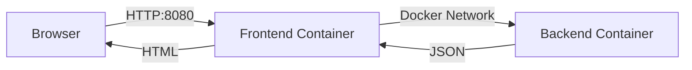

# Docker & Microservices Architecture - Learning Path


This repository documents my learning journey from Docker basics to Microservices. Comments and documentation are in French to reflect my thought process, but code variables and pipelines follow English industry standards.

---

Ce dépôt documente mon parcours d'apprentissage, de la simple conteneurisation à une architecture microservices orchestrée.


## Progression (01 → 05)

| Step | Dossier | Concept validé |
|------|---------|----------------|
| 01 | `01_Hello_World` | Construire une image Docker et exécuter un conteneur Python minimal. |
| 02 | `02_Web_Server` | Exposer un service HTTP via mapping de ports (`-p`) et binding `0.0.0.0`. |
| 03 | `03_Docker_Compose` | Orchestrer un service unique via `docker compose` (build + run déclaratif). |
| 04 | `04_Env_Vars` | Externaliser la configuration via variables d'environnement (`.env` → Compose → app). |
| 05 | `05_Microservices` | Déployer frontend/backend, communication inter-services sur réseau Docker interne. |

## Installation

Prérequis : Docker Desktop.

Pour lancer un projet, copiez le fichier d'exemple pour créer votre configuration locale (depuis le dossier du step) :

```bash
cp .env.example .env
docker compose up
```

**Notes :**
- Les steps `01` et `02` se lancent via `docker build` / `docker run` (voir instructions dans les fichiers).
- Les steps `03`, `04` et `05` s'exécutent via `docker compose`.

## Focus Tech — Step 05 (Microservices)

Architecture finale (simplifiée) :



**Architecture logique :**
```text
[ Browser ]
    |
    | HTTP :8080 (Configurable via .env)
    v
[ Frontend Container ]  ---- Docker Network ---->  [ Backend Container ]
         |                                                 |
         |  URL_DU_BACKEND=http://<backend>:5000           | HTTP :5000
         v                                                 v
     Renders HTML                                     Returns JSON
```

**Commandes (depuis `05_Microservices/`) :**

```bash
cp .env.example .env
docker compose up --build
```

**Endpoints par défaut :**
- Frontend : `http://localhost:8080` (ou port défini dans votre .env)
- Backend : `http://localhost:5000`

## Automatisation (CI/CD)

Le projet dispose d'un pipeline d'intégration continue (**GitHub Actions**) défini dans `.github/workflows/ci.yml`.

**Workflow automatisé :**
1.  **Environment Setup :** Génération dynamique du fichier `.env` à partir du template.
2.  **Docker Build :** Vérification de la compilation des images (Frontend/Backend).
3.  **Deployment Test :** Démarrage de la stack via Docker Compose.
4.  **Smoke Test :** Vérification de la disponibilité des services (Curl avec retries intelligents) pour valider que l'API et le Front répondent correctement (HTTP 200).

## Auteur

**Mathéo Zimmer** - *Ingénieur DevOps / Fullstack*

- GitHub : [MatheoZimmer](https://github.com/MatheoZimmer)
- Email : matheozimmer@gmail.com